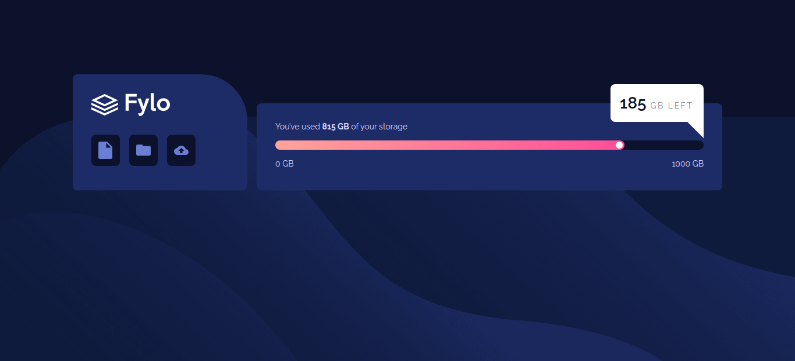
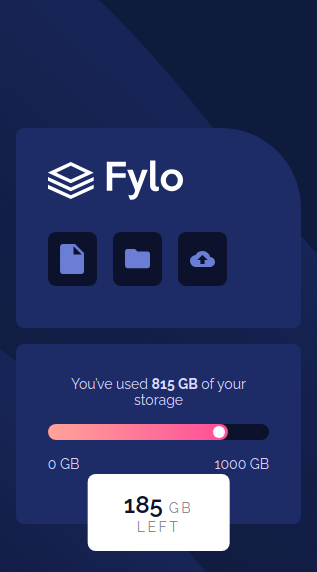

# Frontend Mentor - Fylo data storage component

This is a solution to the [Fylo data storage component challenge on Frontend Mentor](https://www.frontendmentor.io/challenges/fylo-data-storage-component-1dZPRbV5n).

## Table of contents

- [Overview](#overview)
  - [The challenge](#the-challenge)
  - [Links](#links)
  - [Screenshot](#screenshot)
- [My process](#my-process)
  - [Built with](#built-with)
- [Author](#author)

## Overview

### The challenge

Users should be able to:

- View the optimal layout for the site depending on their device's s

### Links
- Solution URL: [Solution](https://github.com/Medido1/Frontend-Mentor-Fylo-data-storage-component)
- Live Site URL: [Live Site](https://medido1.github.io/Frontend-Mentor-Fylo-data-storage-component/)

### Screenshot
  # Desktop
  
  # Mobile
  
## My process

### Built with
- Semantic HTML5 markup
- CSS custom properties
- Flexbox
- Mobile-first workflow

## Author

- Frontend Mentor - [@Medido1](https://www.frontendmentor.io/profile/Medido1)
- Github - [@Medido1](https://github.com/Medido1)
- Contact Me: bousalah.moh@gmail.com
